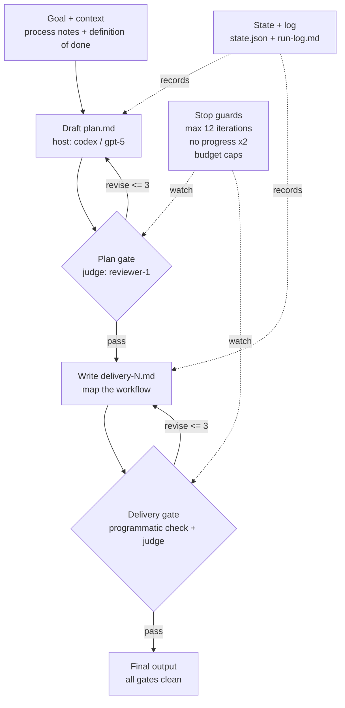

<div align="center">

<pre>
 _        ___   ___  ____  _____ ____
| |      / _ \ / _ \|  _ \| ____|  _ \
| |     | | | | | | | |_) |  _| | |_) |
| |___  | |_| | |_| |  __/| |___|  _ <
|_____|  \___/ \___/|_|   |_____|_| \_\
</pre>

<p>
  <strong>Design agent loops before you run them.</strong><br>
  Goal -> Plan -> Review -> Deliver -> Judge -> Stop clean.
</p>

<p>
  <a href="#quick-start">Quick start</a> |
  <a href="#example-loop-diagram">Example loop</a> |
  <a href="#how-it-works">How it works</a>
</p>

</div>

## Example loop diagram

Looper turns a fuzzy automation idea into a reviewable loop shape before any
runner starts changing files. This example comes from
[`examples/ai-workflow-mapping`](examples/ai-workflow-mapping/loop.yaml).



**A loop design coach for Claude Code.** Looper is a skill that helps you design a *good* agent loop — a sharp goal, checkable verification, and a second model in the review seat — then lets you run it in the same session or save it as a portable spec. It is a design layer first: it writes files and hands the current session a clear execution prompt.

Invoke it with `/looper`. It interviews you, critiques your design against built-in best-practice rubrics, lets you wire in a cross-model reviewer or judge (including non-Claude models), shows you the loop as a terminal-friendly ASCII flow preview, and writes out `RUN_IN_SESSION.md`, `loop.yaml`, a compiled `loop.resolved.json`, and a thin `run-loop.py` you own and edit.

Maintainer: Kevin Simback · GitHub [@ksimback](https://github.com/ksimback) · X [@ksimback](https://x.com/ksimback)
License: MIT

---

## Why not just use `/goal` or `/loop`?

Claude Code already ships two pieces that look loop-shaped. They're useful — and they operate at a different layer than Looper. The short version: **`/goal` and `/loop` *run* a loop; Looper helps you *design* one that's worth running, then gives the current session or an external runner a clear spec to follow.**

### What `/goal` actually does

`/goal` sets a persistent objective for the session. Once set, Claude keeps it as a reference point, checks after each significant action whether the current state satisfies the goal, and keeps working until it does — so it doesn't stop and ask after every step.

That's genuinely useful for persistence. But three things are missing for serious work:

- **No coaching.** `/goal` takes whatever goal you type, however vague. It won't tell you the goal is unfalsifiable or that "done" was never defined. Garbage goal in, confidently-wrong loop out.
- **Self-evaluation by one model.** The goal condition is judged by the *same model doing the work.* That's precisely the blind spot a review council exists to close — the model grading its own homework. In practice this self-check skews unreliable (sometimes too lenient, sometimes too conservative).
- **No structure to inspect or reuse.** The goal lives in the session, not as a portable, versionable artifact. There's no typed verification, no explicit gates, no second model.

### What `/loop` actually does

`/loop` is a **scheduler.** You give it an interval and a task; it turns that into a cron job, registers it, and re-fires the prompt or skill on that cadence — polling CI, watching a deploy, monitoring a background job. (Omit the interval and it self-paces.)

It's the right tool for "run this thing every five minutes until I say stop." It is **not** a loop designer: it doesn't help you decide *what* runs, define success criteria, or bring in a reviewer. It schedules; it doesn't critique.

### Where Looper fits

Looper is the **design layer that sits in front of both.** It produces a well-specified loop — coached goal, typed verification, a cross-model gate — then gives you a default in-session handoff prompt plus a portable spec. The same design can be run immediately in the conversation, driven by `/goal` for persistence, fired on a schedule by `/loop`, or run later with Python. Looper doesn't replace them; it gives them something good to run.

| | `/goal` | `/loop` | **Looper** |
| :-- | :-- | :-- | :-- |
| Layer | execution (in-session) | execution (scheduling) | **design (pre-flight)** |
| Coaches your goal | no | no | **yes** |
| Typed, checkable verification | no | no | **yes (programmatic / judge / human)** |
| Reviewer model | same model (self-check) | none | **a different model, by default** |
| Explicit review gates | implicit | none | **plan gate + delivery gate** |
| Termination guards | goal-condition only | interval / until | **iteration + revision + no-progress + budget caps** |
| Portable, versionable artifact | no | the cron job | **`loop.yaml` + resolved spec** |
| Runs the loop | **yes** | **yes** | **yes, by handing the current session a runnable prompt; Python runner optional** |

The honest summary: if you already know your loop is well-designed and you just need it to persist or to fire on a schedule, `/goal` and `/loop` are the right reach. Looper exists for the part those don't touch — making sure the loop is *worth* persisting before you hand it off, and making sure something other than the author is checking the work.

> Sources for the `/goal` and `/loop` behavior described above: Claude Code skills and commands documentation at code.claude.com/docs. Behavior and version gates change frequently; verify against upstream before shipping.

---

## What Looper provides

Looper provides loop design discipline: a clear goal, context sources,
checkable verification, reviewer/judge gates, termination guards, a portable
spec, a same-session execution handoff, and lightweight run state/log files.

Looper does **not** provide durable orchestration. It does not schedule cron
jobs for you, persist step-level retries across process restarts, manage
sub-agent lifecycles, enforce concurrency controls, or store a production run
history. If you need those guarantees, use Looper to design the loop and hand
the resulting spec to an orchestrator built for durable execution.

## Healthy loop checklist

Before running a loop, Looper pushes you to make these explicit:

- **Goal**: what outcome the loop is trying to produce.
- **Context**: which files, commands, issues, or external sources the loop may
  inspect.
- **Actions**: which model, tools, commands, or human handoffs may change state.
- **Feedback**: which programmatic checks, judges, reviewers, or humans decide
  whether work is good enough.
- **State**: where the loop records status, decisions, blockers, and outputs.
- **Stop conditions**: success, max iterations, revision caps, no-progress
  signals, and budget caps. The external runner enforces wall-clock caps;
  token/USD caps are operator-visible advisory limits unless you add accounting
  around the configured CLIs.
- **Execution boundary**: current workspace, branch/worktree, external runner,
  or a separate durable orchestrator.

---

## Quick start

Install as a global personal skill and slash command.

On Windows PowerShell:

```powershell
irm https://raw.githubusercontent.com/ksimback/looper/main/install.ps1 | iex
```

On macOS/Linux:

```bash
curl -fsSL https://raw.githubusercontent.com/ksimback/looper/main/install.sh | bash
```

If you prefer to inspect each step, use the manual install:

<details>
<summary>Manual install commands</summary>

Windows PowerShell:

```powershell
git clone https://github.com/ksimback/looper "$env:USERPROFILE\.claude\skills\looper"
New-Item -ItemType Directory -Force "$env:USERPROFILE\.claude\commands" | Out-Null
Copy-Item "$env:USERPROFILE\.claude\skills\looper\commands\looper.md" "$env:USERPROFILE\.claude\commands\looper.md" -Force
```

macOS/Linux:

```bash
git clone https://github.com/ksimback/looper "$HOME/.claude/skills/looper"
mkdir -p "$HOME/.claude/commands"
cp "$HOME/.claude/skills/looper/commands/looper.md" "$HOME/.claude/commands/looper.md"
```

</details>

Then, in Claude Code:

```text
/looper
```

Looper interviews you, writes the artifacts into a folder called `looper-output`,
and shows you an ASCII flow preview to confirm before anything is finalized. The
installer also creates a private `.venv` inside the skill directory and installs
`PyYAML`, which the helper compiler needs to read `loop.yaml`. It
then offers to run the loop right there in the same Claude Code session.

If you want a different folder name, pass it after `/looper`, for example
`/looper client-onboarding-loop`.

### Easy: run in the same session

The default path is to let Looper continue in the same conversation. It follows
the generated `RUN_IN_SESSION.md` handoff, writes `plan.md`,
`delivery-N.md`, `review-N.md`, `state.json`, and `run-log.md` into the loop
workspace, and stops when the gates pass, a cap is reached, or repeated
no-progress is detected.

### Advanced: run outside the session

Use the Python runner when you want to run the loop later, repeatably, from
another terminal, or outside the LLM session:

```bash
python3 ./looper-output/run-loop.py
```

For local development, this repository root is the skill root. Edit and test it
here, then install or update the global skill by cloning or copying the repo to
`$HOME/.claude/skills/looper` and copying `commands/looper.md` to
`$HOME/.claude/commands/looper.md`.

If Claude Code says `Unknown command: /looper`, check both install locations:

- The skill must exist at your real home directory, for example
  `C:\Users\kevin\.claude\skills\looper` on Windows.
- The slash command must exist at `C:\Users\kevin\.claude\commands\looper.md`
  on Windows.
- If you see a literal folder named `~` inside your project, your shell did not
  expand `~`; rerun the installer or manual PowerShell commands above.

---

## How it works

1. **Goal** — you state it; Looper critiques and tightens it.
2. **Verification** — Looper forces checkable criteria, classified as programmatic (a command returns pass/fail), judge (a model scores a rubric), or human (you sign off).
3. **Host model** — pick the model that drives the loop.
4. **Council** — add a reviewer (notes) or judge (verdict); Looper recommends a *different* model family than the host and explains why.
5. **Gates & control** — confirm where review happens, revision and iteration caps, no-progress signals, budget limits, human checkpoints, and execution boundaries. Looper won't emit a loop with no termination guard.
6. **Confirm** — review the loop as an ASCII flow preview.
7. **Run or emit** — Looper writes `RUN_IN_SESSION.md`, `loop.yaml`, `loop.resolved.json`, `run-loop.py`, an empty workspace, and a README. The default is to offer to run the loop in the current session; the Python runner is there for external control.

A council sends your project context to another model's CLI. Looper makes that explicit, applies default redactions, lets you scope what's sent, and asks for consent before the first cross-vendor send. Pick a local model (e.g. via `ollama`) to keep the council in-house.

## License

MIT © Kevin Simback
