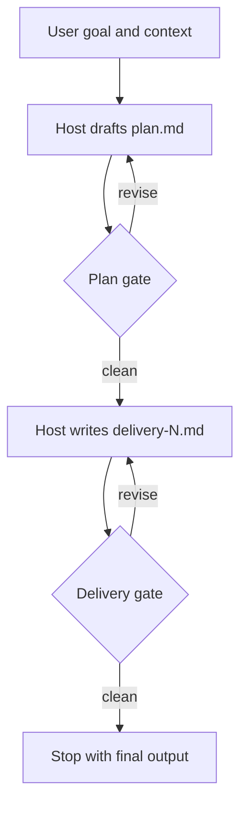

# Looper

Use Looper as a loop design coach and scaffolder. Do not run loop work from
this skill process. The skill interviews, critiques, validates, and writes
files. The emitted `run-loop.py` is the only artifact that executes a loop.

## Workflow

1. Resolve the target path from the `/looper` argument. If no target is given,
   use `./looper-output`. If the target contains an existing `loop.yaml`, treat
   the task as an edit/resume instead of a fresh scaffold.
2. Load the relevant rubric only when entering that stage:
   - Goal stage: `references/goal-rubric.md`.
   - Verification stage: `references/verification-rubric.md`.
   - Council stage: `references/council-rubric.md`.
   - Control stage: `references/control-rubric.md`.
   - Model detection or privacy details: `references/model-detection.md`.
3. Interview in seven stages: goal, verification, host model, council,
   gates/control, confirmation diagram, emit.
4. Critique each stage before accepting it. Prefer concrete alternatives over
   vague warnings. Push weak goals toward outcome, scope, context, and done
   state. Push weak verification toward programmatic checks first, then judge
   rubrics, then human signoff.
5. Keep reviewer and judge roles distinct. A reviewer writes notes. A judge
   returns a structured verdict. `revise_until_clean` must name a judge member
   or `human` as `verdict_source`.
6. Require at least one termination guard: `max_iterations`, a revision cap on
   each gate, a budget cap, or an explicit human stop point. Prefer multiple
   guards.
7. Before any cross-vendor council member is selected, state what context will
   leave the user's machine, which CLI receives it, which redaction globs apply,
   and that the emitted runner will ask for first-send consent.
8. Show a Mermaid diagram of the planned loop and ask for confirmation before
   final emission.
9. Emit these files into the target:
   - `loop.yaml`
   - `loop.resolved.json`
   - `LOOP.md`
   - `run-loop.py`
   - `loop-workspace/`
   - `README.md`
10. After writing `loop.yaml`, run:
   `python3 ${CLAUDE_SKILL_DIR}/scripts/looper.py compile <target>/loop.yaml --out <target>/loop.resolved.json --render <target>/LOOP.md`
   If `python3` is not available, try `python`.

## File Rules

- Write argv arrays, never shell command strings, for all model and check
  invocations.
- Do not write API keys, access tokens, passwords, or CLI auth material into
  `loop.yaml`, `loop.resolved.json`, or model registries.
- Default redaction globs are `.env`, `.env.*`, `secrets/**`, and `**/*.key`.
- Keep `loop.yaml` human-readable and commented where useful. The emitted
  runner reads only `loop.resolved.json`.
- Copy `templates/run-loop.py` exactly unless the user explicitly asks to edit
  the runner contract.

## Helper Scripts

- Detect model CLIs:
  `python3 ${CLAUDE_SKILL_DIR}/scripts/looper.py detect-models --write`
- Register a custom CLI:
  `python3 ${CLAUDE_SKILL_DIR}/scripts/looper.py register-model <id> --invoke <cmd> [args...]`
- Compile and render:
  `python3 ${CLAUDE_SKILL_DIR}/scripts/looper.py compile <target>/loop.yaml --out <target>/loop.resolved.json --render <target>/LOOP.md`

## Confirmation Diagram

Use this shape and customize labels:

## Emit Checklist

- The goal has a clear outcome, scope boundary, context sources, and done state.
- Verification criteria are typed as `programmatic`, `judge`, or `human`.
- At least one criterion is not purely vibe-based unless the user explicitly
  accepts that risk.
- Each `revise_until_clean` gate has a valid `verdict_source`.
- Every external invocation is an argv array with a timeout.
- Cross-vendor egress is scoped, redacted, and consent-gated.
- `loop_control` has iteration, revision, and wall-clock or budget caps.
- `loop.resolved.json` compiles successfully before handoff.

