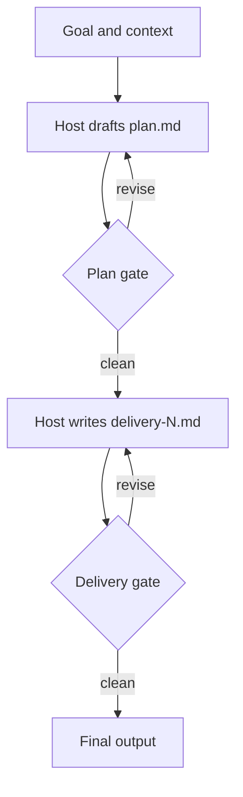

# ai-workflow-mapping

Map a customer's manual workflow into an agent-ready process.

## Goal

Produce an agent workflow map that converts the process notes into a stepwise design with tool calls, model responsibilities, and human checkpoints.

## Definition of Done

A LOOP.md-style workflow map exists, every step has an owner, input, output, and checkpoint decision where needed, and there are no TBDs.

## Verification

- `required-sections` (programmatic)
- `covers-goal` (judge)

## Council

- `reviewer-1`: judge via claude (default)

## Gates

- Plan gate: revise_until_clean
- Delivery gate: revise_until_clean

## Loop Control

- Max iterations: 12
- Budget: `{"tokens": 2000000, "usd": 5.0, "wall_clock_min": 30}`
- No-progress: `{"action": "stop", "max_stalled_iterations": 2, "signals": ["same blocking issue repeats", "delivery artifact has no material change", "verifier output is unchanged"]}`

## Execution Boundary

- Mode: `in_session`
- Isolation: `current_workspace`
- Side effects: `{"duplicate_action_check": true, "requires_approval": true}`

## Observability

- State file: `state.json`
- Run log: `run-log.md`
- Checkpoint granularity: `gate`

## Diagram

